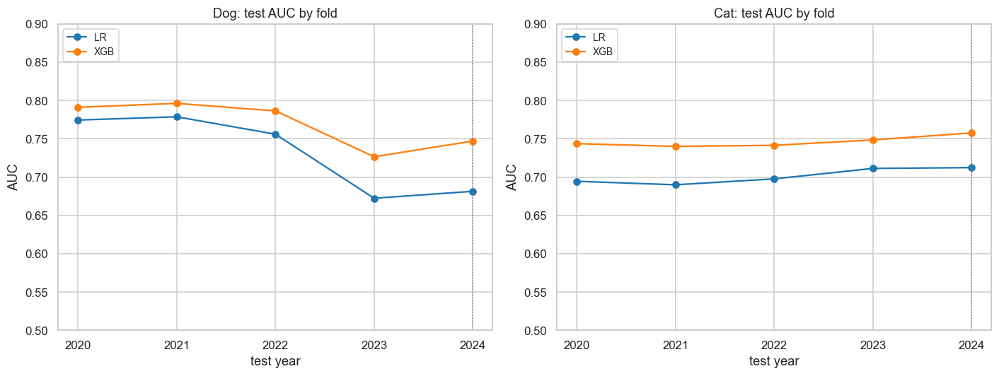
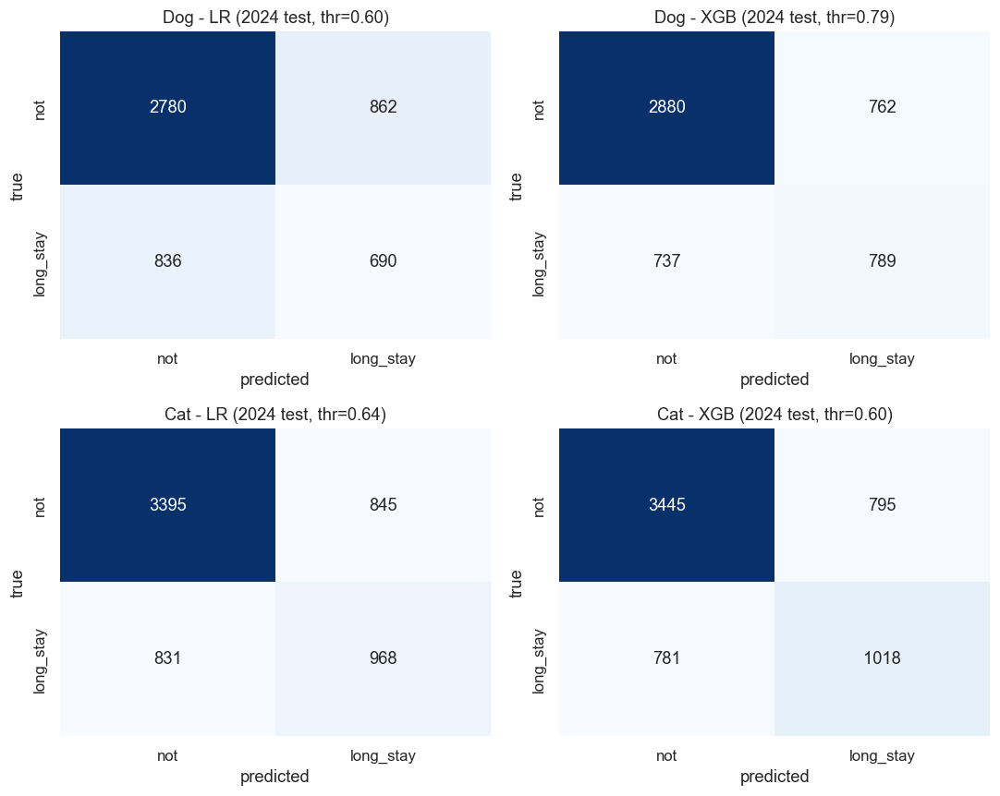
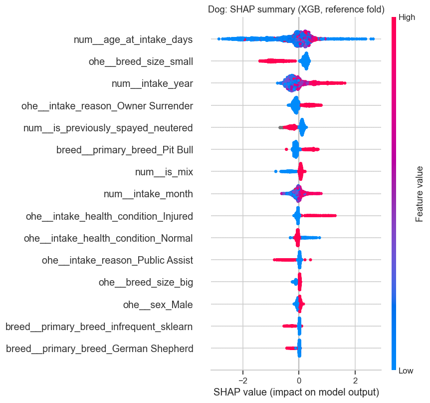
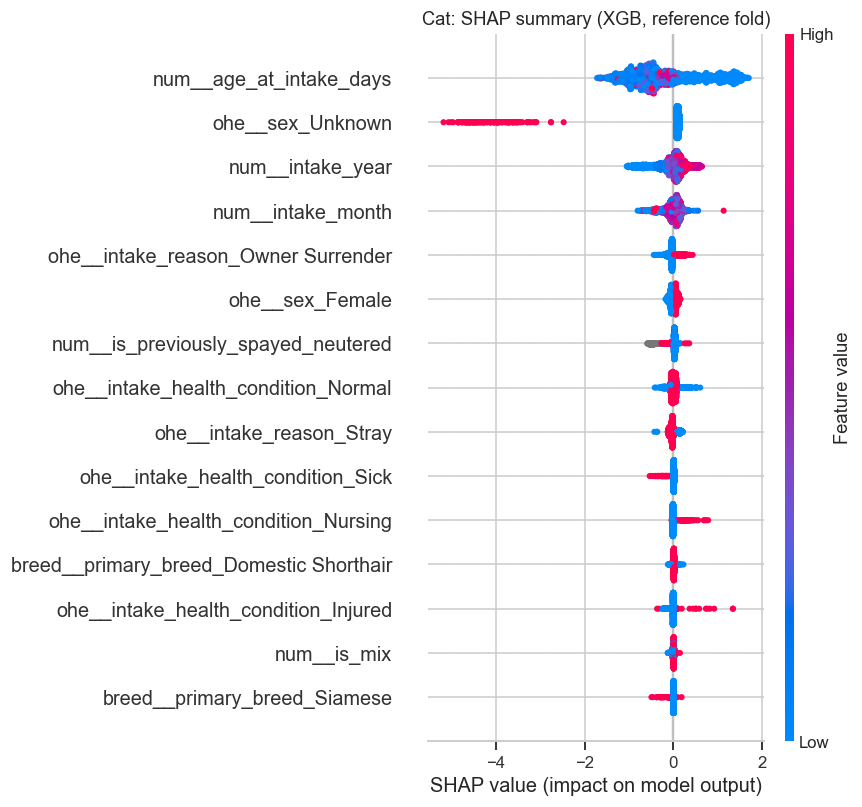
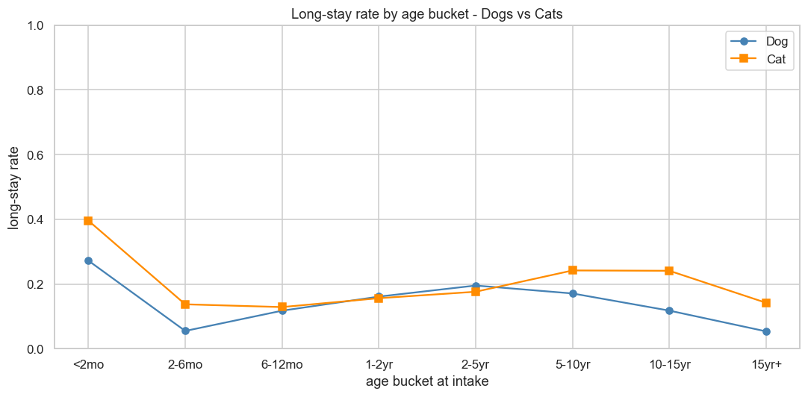

# Predicting Long-Stay Shelter Animals — Austin Animal Center (2013–2025)

<p align="center">
  
  
  
  
</p>

> Flagging the dogs and cats most likely to get stuck in the shelter, **on the day they
> arrive**, so staff can step in early instead of reacting weeks too late - flag the top 30% of each day's arrivals and you catch about **half** the animals that go on to get stuck, with about half the flagged list turning out to be real.

---

## 1. The problem

Austin Animal Center is a large open-intake municipal shelter. It has been facing constant overcapacity and prolonged kennel stays since 2021, due to a pandemic-related decline in adoptions and spay/neuter procedures. Animals that stay a long time consume kennel space, staff hours, and medical cost.

The question this project answers: using only what is known the day an animal walks in, can we predict whether it will become a long-stay (>30 days) case? A reliable early flag lets staff prioritise foster placement, targeted marketing, or behavioural support before an animal lingers.

This is framed as a binary classification task with target is_long_stay (1 = stay > 30 days).

---

## 2. The data

Everything here is built on Austin Animal Center's own public records, published on the
[City of Austin Open Data Portal](https://data.austintexas.gov/). The shelter logs two things:
every animal that comes **in** (an *intake* record) and every animal that leaves, for any
reason (an *outcome* record). This project uses the full history from **October 2013 to May
2025** — roughly 174,000 intake events and 174,000 outcome events.

After matching each arrival and departure record and narrowing to dogs and
cats, the analysis runs on **162,932 animal stays**.

> **Included in this repo, no download needed.** Both raw exports are committed under
> [`data/raw_dataset/`](data/raw_dataset/) (Intakes ≈ 29 MB, Outcomes ≈ 24 MB), so the
> full pipeline runs without touching the portal. **Data license: Public Domain** (City of
> Austin Open Data Portal).

---

## 3. What the project delivers

The result is an **early-warning flag**: on intake day, each dog or cat is scored for how
likely it is to become a long-stay case, using only what's actually known at that moment.

**The operating point is set by capacity, not by a metric target.** A shelter can only act on so
many animals, so the flag marks the **top 30% of each day's intakes by risk score** (`FLAG_RATE`)
and the recall/precision that buys is read off, rather than fixed in advance. On the 2024 test year
that is recall 0.52 at precision 0.51 for dogs, and 0.57 at 0.56 for cats.

**Why 30% is a natural place to stand.** It sits almost exactly on the base rate — about 30% of
intakes really do become long stays — so the number flagged and the number that genuinely become
long-stay are nearly equal, and precision, recall and F1 collapse onto a single number: **0.51 for
dogs, 0.56 for cats**. One figure describes the whole operating point: flag three in ten, catch
about half of the future long-stays, and about half of the list is real.

**The rule is rank-based, not a fixed probability cut-off.** Predicted probabilities drift upward
year over year (§6), badly enough on the dog side that a probability threshold fitted on 2022–2023
would select 65% of the 2024 dogs instead of the 44% it was tuned for. A percentile is immune —
inflation moves every score together and leaves the ordering untouched — so the flagged share is
exactly 30% every year, with nothing to re-derive.

`FLAG_RATE` is a single dial, and the notebook prints the full menu of what each setting buys.
Widening it to 50% would catch 77% of long-stay dogs but drop precision to 0.46; narrowing it to
20% lifts precision to 0.54 while catching only 37%. **`precision = 0.8` is out of reach at any
setting** — even the top 1% of the ranking reaches only ~0.77 (dog) / ~0.78 (cat), a ceiling set by
model strength rather than by threshold choice.

For the technically inclined, here are the underlying numbers, back-tested on a held-out
future year (2024) the models never saw during development:

| Species | Model | AUC | Precision | Recall | F1 |
|---------|-------|-----|-----------|--------|-----|
| Dog | XGBoost | 0.747 | 0.509 | 0.517 | 0.513 |
| Dog | Logistic Reg. | 0.681 | 0.445 | 0.452 | 0.448 |
| Cat | XGBoost | 0.758 | 0.562 | 0.566 | 0.564 |
| Cat | Logistic Reg. | 0.712 | 0.534 | 0.538 | 0.536 |

*Scored on the 2024 test year, flagging the top 30% of that year's intakes by score.*  
*LR is the baseline; XGBoost is the principal model and wins on every metric for both species.*  
*Precision, recall and F1 are near-identical within each row because a 30% flag rate sits on the 30%
base rate — the number flagged and the number genuinely long-stay are almost the same.*  
*AUC is threshold-free, so it is the number to compare models on; the rest move with `FLAG_RATE`.*

Across the full five-fold back-test — each year predicted by a model trained only on the years before it:

| Species / model | 2020 | 2021 | 2022 | 2023 | 2024 | mean ± std |
|---|---|---|---|---|---|---|
| Dog · XGBoost | 0.791 | 0.796 | 0.786 | 0.727 | 0.747 | 0.769 ± 0.031 |
| Dog · Logistic Reg. | 0.774 | 0.779 | 0.756 | 0.672 | 0.681 | 0.733 ± 0.052 |
| Cat · XGBoost | 0.744 | 0.740 | 0.741 | 0.749 | 0.758 | 0.746 ± 0.007 |
| Cat · Logistic Reg. | 0.695 | 0.690 | 0.698 | 0.711 | 0.712 | 0.701 ± 0.010 |

Cats are stable across every fold; dogs sat on a plateau near 0.79 and then broke in 2023 (see §4). Only
2024 is held out — 2022 and 2023 set the features and the operating point, and 2020/2021 are trace-only.

|  |  |
| :---: | :---: |
| Figure 1. Test AUC by fold (2020–2024), per species and model. | Figure 2. Confusion matrices on the 2024 test fold, flagging the top 30%. |

---

## 4. How it works — data, modelling, and the judgment calls


Figure 3. The five-stage data-flow pipeline, from raw Austin Open Data exports to per-species modeling

### The project runs as a five-stage data-flow pipeline

Stage 1 · Raw Data Sources — Two CSV exports from the City of Austin Open Data Portal (2013-10-01 → 2025-05-05): an Intakes file (173,812 rows, one row per intake event) and an Outcomes file (173,775 rows, one row per outcome event).  

Stage 2 · Clean & Merge (01_cleaning) — Python/pandas notebook that aligns both exports to a shared schema and backward-merges each outcome to its most recent prior intake, producing one row per completed animal stay. It then adds 467 still-in-shelter animals that have no outcome yet but whose elapsed stay already exceeds 30 days, labeled positive.

Stage 3 · Processed Dataset — Writes df_full_merged.csv to disk (162,932 rows × 27 columns, filtered to dogs & cats). This single file is the source every downstream notebook reads from.  

Stage 4 · EDA (02_eda) — Exploratory analysis; its findings inform the feature choices used in modeling.  

Stage 5 · Modeling (03_modeling) — Predicts is_long_stay separately per species using Logistic Regression and XGBoost. Outputs predictions only.  

### Key judgment calls   

- Modelling dogs and cats separately.
- Each outcome is matched to its arrival with a **backward `merge_asof`** on animal ID. Every departure is joined to its *most recent prior* intake. Drop outcomes with no matching intake (~0.5%) and outcomes re-claiming the same intake.
- Long stay is derived from outcome, so *every* outcome-derived column is a leakage -> remove from features. 
- Random split would cause data leakage in time-series data, so the model is trained on data up to year $Y-1$ and tested on year $Y$, walking forward.
  | fold | train years | test year | role |
  |---|---|---|---|
  | 1 | 2013–2019 | 2020 | trace only (drives no decision) |
  | 2 | 2013–2020 | 2021 | trace only (drives no decision) |
  | 3 | 2013–2021 | 2022 | **decision** (features + operating point) |
  | 4 | 2013–2022 | 2023 | **decision** (features + operating point) |
  | 5 | 2013–2023 | 2024 | **test** (held out — drives no decision) |

  One constant, `DECISION_YEARS = [2022, 2023]`, drives both feature selection and the operating point, so the two decision folds carry identical responsibility and 2024 stays clean. 2020 and 2021 are deliberately kept out of the decision set: they are COVID-shaped years whose regime does not match the deployment era — specialising on 2021 is exactly what costs the 2022 fold when `intake_year` is added.

  **2020 and 2021 are trace-only folds.** They extend the AUC history two years earlier and give `AUC_std` five points instead of three. They earn their place: dog XGB holds 0.791 / 0.796 / 0.786 across 2020–2022, so the 2023 fall reads against a three-fold plateau rather than against a single prior year. Five points is still a small sample — read `AUC_std` as indicative.

- **The dog model broke in 2023** — XGB AUC held 0.791 / 0.796 / 0.786 across the 2020–2022 folds, then fell to 0.727 in 2023 and recovered only partly to 0.747 in 2024. Cats held 0.740–0.758 across all five folds, so there is no cat equivalent. Appendix 1 of `03_modeling.ipynb` diagnoses it by elimination. The short version: AUC is invariant to the base rate, so the long-stay rate jumping to 0.315 cannot be the cause. What actually happened is that **the adoption pathway slowed ~1.9x** (median 14 → 27 days) while transfer got *faster* and return-to-owner did not move — which rules out a general shelter jam. Small and big dogs slowed by the *same* factor; body size only decided how close a dog already sat to the fixed 30-day line, and that is what turned a proportional slowdown into a lopsided label shift. **Why adoption slowed is not answerable from this export** — it holds no adopter counts, foot traffic, listing dates or policy records.
- Feature selection of breed and spay/neuter is decided by ablation on **both** decision folds, reported per fold plus the mean. An ablation compares AUC with vs. without a feature, so it reads a relative gap rather than the absolute AUC level, which makes it less sensitive to the base-rate drift that pushed the absolute 2023 AUC down.
  - **Both folds, because two of the four ablations flip sign between 2022 and 2023.** Dropping `is_sn` *helps* the dog LR on 2022 (+0.0016) and *hurts* it on 2023 (−0.0036). A single-fold call would have landed on whichever year happened to be used — and 2023 is the anomalous year Appendix 1 dissects, making it the worst fold to decide alone on.
  - Results are the **mean of per-fold AUCs, never one AUC over pooled predictions**: the folds sit on different score scales — for dogs the XGB mean predicted probability is 0.446 on the 2022 fold against 0.520 on 2023 — so pooling leaks the year signal into the ranking, a bias larger than most of the effects being measured. §8.1 prints the level for every fold.
  - Keep *Cat breed*: MI was **0.001**, which argues for dropping, but MI misses interactions. The LR ablation (no tuning, so a clean read) is flat at ±0.0003 and unstable in sign. The XGB ablation passes through the tuning grid, so its delta mixes the feature's effect with where the grid landed — re-running one fold across 5 seeds spans −0.0022 to +0.0125.
  - Keep *Spay/neuter vs. age*: correlated (r ≈ 0.41 dog, 0.59 cat), raising a redundancy worry, but VIF is 1.2–1.5, well under the usual 5–10 flag. Mean deltas are −0.0010 (dog) / −0.0015 (cat) — inside noise.
  - In both cases the call is **"nothing justifies removal, and the column costs nothing"** — not a measured gain. Deciding on 2023 alone would have overstated the evidence.
- Handling imbalance  
Long-stay cases are the minority class (by intake year over the full years 2014–2024, dog 0.11–0.32, cat 0.17–0.34). Re-weighting the positive class (`class_weight='balanced'` for LR and `scale_pos_weight` for XGBoost). 

### Features — how each input is selected, encoded, or cleaned before modeling
 
| Feature handling | Dog | Cat | Where decided |
|---|---|---|---|
| Selected feature set | intake reason, breed, **`breed_size`**, health condition, sex, age, `is_sn`, `is_mix`, **intake month**, **intake year** (10) | same minus `breed_size` (9) | MI screening, then back-test ablation |
| `breed_size` (small <25 lbs / big) | **added**, −0.002 / +0.007 / +0.009 AUC on the 2022 / 2023 / 2024 folds — a recent-fold gain, not a uniform one | **not used** — ~95% of cats are domestic short/medium/longhair (83% shorthair alone), so there is little size structure to find (measured: −0.005 / +0.001 / +0.001, noise that flips sign) | The 2023 diagnosis pointed at the 30-day line, and size sets distance to it. No weight column exists in the data, so the mapping is stated in code as external domain knowledge, not a derivation |
| `intake_year` | **added**, +0.006 mean AUC (−0.003 / +0.013 / +0.009) | **added**, +0.006 mean (+0.005 / +0.006 / +0.008) | A test year never appears in training, so a tree saturates at its last split and applies the most-recent-era rules — implicit recency weighting. Known at intake, so not leakage. Encoded numerically for XGB but **one-hot for LR**, since a linear model would extrapolate the yearly trend without bound |
| Intake month | **restored**, though flat to slightly negative for dogs (−0.007 / +0.002 / −0.005) | **restored**, +0.004 mean AUC (+0.009 / +0.004 / +0.001) | Originally cut on univariate MI (0.0002 dog / 0.0084 cat). MI is a *marginal* measure and cannot see conditional effects — it should rank what to explore, not decide final inclusion |
| Dropped features | colour (primary/secondary/pattern) | same | Near-floor MI (≤ 0.0013) **plus** a 2023-fold ablation — not MI alone |
| Breed encoding | top-**60** + Other | top-4 + Other | `Breed` is a free-text field with 385 distinct primary values. A top-20 cap pushed 26.7% of dogs into one 'Other' column spanning long-stay rates from 0.01 to 0.32. Top-60 covers 92.5%; top-100 adds 5pp more |
| `is_sn` (spay/neuter) | kept | kept | Collinearity ablation over both decision folds (mean Δ AUC −0.0010 dog / −0.0015 cat — inside noise; kept for want of a reason to drop) |
| Age (XGBoost) | raw `age_at_intake_days` | same | Tree model, scale-invariant |
| Age (Logistic Reg.) | 8 buckets: <2mo … 15yr+ | same | EDA |
| Health condition | keep Normal / Injured / Sick / Nursing / Neonatal, rest → Other | same | Keep the well-populated levels, merge <1000 categories into 'Other' |
| Encoder fitting | one-hot + top-N breeds, re-fit per fold on train only | same | Prevents fold-to-fold leakage |
 
### Model & validation — training, tuning, and back-test setup
 
| Setting | Dog | Cat | Where decided |
|---|---|---|---|
| Long-stay threshold (target) | > 30 days | > 30 days |  From shelter's announcement |
| Operating point | flag top **30%** by score (`FLAG_RATE`) | same | Set by operational capacity, not by a metric target. Rank-based, so the flagged share is exact regardless of probability drift, and 30% ≈ the base rate makes precision ≈ recall ≈ F1 |
| Class imbalance | per-fold `scale_pos_weight` (XGB) / balanced weights (LR) | same | Recomputed per fold as base rate drifts |
| XGBoost tuning grid | depth ∈ {3, 5}, lr ∈ {0.03, 0.1}, n_estimators ≤ 800, early stop 30 | same | Nested CV (inner = last train year) |
| Logistic Reg. | L2, C = 1.0, max_iter = 2000 | same | Fixed regularised baseline |
| Back-test folds | test years 2020–2024, expanding window (2020/2021 trace-only) | same | Rolling-origin |
| Validation / test fold | feature decisions + operating point on 2022 **and** 2023; headline on 2024 | same | 2024 never used for selection/tuning |

---

## 5. What actually drives a long stay

Drivers are read from **SHAP values on the reference-fold model** (train ≤ 2023), not impurity
importance (biased toward high-cardinality features like breed):




**Figure 4. SHAP summary for the dog XGBoost model**  

Each dot is one dog; x-position is that feature's push on the prediction (right = toward long-stay, left = toward faster exit). Color encodes the feature's value: for age, red = older; for 0/1 features (breed, owner-surrender, spay/neuter), red = positive.  

Ranking by mean |SHAP|: age (0.55) → **`breed_size_small` (0.42)** → **`intake_year` (0.29)** → owner-surrender (0.17) → `is_sn` (0.16) → Pit Bull (0.16).

Age ranks first, and its red/blue spread on both sides is the non-monotonic effect. `breed_size_small` is the clearest single band in the plot — red (small) sits entirely on the left, pushing toward a fast exit — and it absorbed most of what individual small-breed dummies used to carry, which is why Pit Bull has slipped to sixth. Owner-surrender, injured and Pit Bull push toward long-stay.

<br clear="left"/>
<br><br>



**Figure 5. SHAP summary for the cat XGBoost model**  

Each dot is one cat; x-position is the feature's push (right = toward long-stay, left = toward faster exit); color is the feature's value (for age, red = older; for 0/1 features, red = present).  

Ranking by mean |SHAP|: age (0.70) → Sex_Unknown (0.37) → **`intake_year` (0.21)** → **`intake_month` (0.13)**.

Age ranks first with a non-monotonic red/blue spread. Sex_Unknown is the longest tail in the plot: present (red) pushes strongly left. These intakes are overwhelmingly newborn kittens (median age 22 days) transferred out on day 0 (~86% transfer, ~0% adoption), likely too young to be sexed at intake and routed straight to foster/rescue rather than entering the shelter pipeline. In contrast, owner-surrender, nursing and injured push toward long-stay.


<br clear="left"/>
<br><br>




**Figure 6. Long-stay rate by age at intake, dogs vs cats**  

In EDA we can see the age effect is *non-monotonic* for both dog and cat: the youngest puppies (under ~2 months) carry the highest long-stay risk (~27%), risk collapses in adolescence (~5% at 2–6 months), climbs again through prime adulthood, then falls for seniors. Very young kittens are highest-risk (~40%), and risk *rises* again into the senior years, then decreases for 15+ cats.

<br clear="left"/>

---

## 6. Limitations

### Model & methodology

- **Half of all future long-stay animals are missed at the chosen flag rate.** At the top 30%, recall
  is 0.52 (dog) / 0.57 (cat). That is a capacity choice rather than a model ceiling — flagging 50%
  would catch 77% of long-stay dogs, but at precision 0.46 — yet it does mean the flag is a triage
  aid, not a safety net. Separately, **`precision = 0.8` is out of reach at any operating point**:
  even the top 1% of the ranking tops out near 0.77 (dog) / 0.78 (cat), a ceiling set by model
  strength and a 30% base rate.

- **The saved threshold is a percentile, not a number to carry forward.** The stored value is the 30%
  cut evaluated on the test year. Because probabilities inflate across years (below), re-derive it as
  the same percentile of whatever cohort you score — the rank rule holds its meaning, the number does
  not.

- **Predicted probabilities are not trustworthy, and `intake_year` made that worse.** Per-fold class
  weighting already distorted calibration; adding `intake_year` pushed the dog 2024 Brier from 0.204 to
  0.279, with a mean predicted probability of 0.60 against a true rate of 0.30 — and the inflation grows
  the further ahead you forecast. This is why the operating point is a **percentile, not a
  probability**: a rank rule is unaffected by inflation that moves every score together. Use the
  ranking; never read a raw probability as a likelihood.

- **`intake_year` buys ranking on the recent folds but costs the 2022 fold.** Measured on the back-test
  it is −0.003 on 2022 (which trains through 2021, still a COVID-shaped year, so specialising on it
  hurts) against +0.013 on 2023 and +0.009 on 2024. A deliberate trade in favour of the recent folds.

- **The 2023 dog break is diagnosed but not fully explained.** Appendix 1 narrows it to an
  adoption-pathway slowdown and rules out a general shelter jam, but *why* adoption slowed is not
  answerable from this export. The dog model remains less stable than the cat model.

- **Only intake-day information is used (10 features for dogs, 9 for cats).** No behavioral
  assessments, photos, or any post-intake signal. This is by design (the model must
  score an animal on day one), but it likely sets the AUC ceiling at ~0.75–0.80.


### Data & scope

- **System migration limits scope to pre-May 2025 legacy data**
This project utilizes historical CSV extracts from the shelter's legacy system, with records concluding on May 5, 2025. The shelter has since migrated to a new platform that employs a different identification schema for animals, intakes, and outcomes. Because the internal mapping logic required to reconcile the legacy IDs with the new structure is unavailable, recent records cannot be ingested. Consequently, this analysis is restricted to the historical dataset.

- **Intake status does not guarantee adoption eligibility.**  
Per the Austin Animal
  Center metadata, intake records represent the status of animals as they arrive at
  the shelter; the data does not indicate whether an animal was ever eligible for
  adoption. Some long stays may therefore reflect legal holds or ineligibility rather
  than low adoption appeal, and the model cannot distinguish the two.

---

## 7. Future work

- **Integrating post-migration data**  
Building a data bridge between the legacy and modern systems. By developing a crosswalk logic to reconcile the differing ID schemas, integrate post-migration records, update our ETL pipeline, and transition this historical analysis into a real-time predictive tool.

- **Post-intake signals** — *to addresses "only intake-day information is used".*  
  The model deliberately scores an animal on day one, which likely caps AUC at
  ~0.75–0.80. If later signals (behavioral assessments, medical updates, photos)
  were incorporated as they arrive, a second-stage model could refine the day-one
  flag for animals still in the shelter.

- **Length of stay prediction**  
The current target collapses time-to-exit into a single yes/no at 30 days. A separate regression, trained on animals with an observed length of stay, would predict the actual number of days, creating a finer signal for triage than the binary flag.

- **Adoption-side data** — *addresses the one gap Appendix 1 could not close.*  
  The 2023 break traces to the adoption pathway specifically, but this export holds no adopter
  counts, foot traffic, time-to-listing or adoption-event calendars. Those fields are what would
  turn "adoption slowed" into an explanation, and they would likely absorb the drift the model
  currently cannot see.

- **Drift monitoring** — *addresses "the base rate keeps drifting".*  
  The long-stay base rate moves year to year (23.8% → 21.7% → 24.6% → 30.7% → 29.7% across the five test folds), and the pipeline has no way
  to notice. A base-rate / PSI drift check on incoming data would catch it. The operating point
  itself no longer needs re-tuning: `FLAG_RATE` is a percentile, so it holds its meaning as scores
  drift.


## 8. Lessons learned

- **I didn't fully understand the business problem in the beginning**  
My initial instinct was to predict whether an animal would be adopted. Only when writing the report did I realize this missed the shelter's real pain point: limited space and capacity, where the true strain comes from animals that stay stuck for a long time. I therefore redefined the target from is_adopted to is_long_stay, shifting the focus from "Will this animal be adopted?" to "Will it occupy space long-term, so staff can intervene early?"


- **Changing the business problem forces the data-cleaning logic to be re-audited.**  
When I switched the target from is_adopted to is_long_stay, I kept the original data-cleaning pipeline unchanged, and that inherited logic silently biased the dataset. Because the merge was keyed on outcomes, any animal still in the shelter, which has no outcome yet, was dropped entirely, and those are exactly the longest-staying animals the new target was meant to find. I recognized the problem and added back 467 still-in-shelter animals as confirmed long stays and restored the population the inherited merge had removed.

---

## 9. Pipeline & repository

```
01_cleaning.ipynb  →  02_eda.ipynb  →  03_modeling.ipynb
```

| Notebook | What it does |
|----------|--------------|
| **01_cleaning** | Audits every raw column as drop-down vs free text (which is how `Breed` was caught as free text carrying 236 colour values); aligns both raw exports to a shared snake_case schema; normalises mixed-timezone dates; backward `merge_asof` join of each outcome to its most recent prior intake; drops orphans/duplicates; parses sex/breed/colour; engineers the `is_long_stay` target and intake-time features; filters to dogs & cats → `df_full_merged.csv` (162,932 rows). |
| **02_eda** | Per-species univariate, bivariate (long-stay rate by feature), and temporal analysis; correlation heatmaps and mutual-information screening against the target. EDA only — no modelling. |
| **03_modeling** | Time-aware folds; per-species Logistic Regression + XGBoost; feature ablations on both decision folds (2022, 2023); five-fold back-test with the headline on 2024; `FLAG_RATE` operating point; confusion matrices; SHAP interpretation; Appendix 1's diagnosis of the 2023 dog break; exports the headline models to `models/`. |

> **`models/` is current.** The artefacts are written from the *same* fitted objects §8 evaluates — nothing is refit on export — so they reproduce the numbers in this README exactly; the notebook asserts this by reloading each bundle and comparing probabilities. They are gitignored (regenerable), so run `03_modeling.ipynb` to recreate them locally. Each species gets a `.joblib` bundle (pipeline + threshold + card), a native `_booster.json`, and a standalone `_card.json`.

```
.
├── data/
│   ├── raw_dataset/        # two raw Austin exports, committed
│   │                       #   (filenames carry a _20260523 date stamp)
│   └── processed/
│       └── df_full_merged.csv   # generated by 01_cleaning — gitignored, not committed
├── notebooks/
│   ├── 01_cleaning.ipynb
│   ├── 02_eda.ipynb
│   └── 03_modeling.ipynb
├── LICENSE                 # MIT License (covers the code)
├── README.md
└── requirements.txt        # pinned dependencies (Python 3.13)
```

---

**Acknowledgements:** City of Austin and Austin Animal Center for publishing the open
intake and outcome data that makes this project possible.
